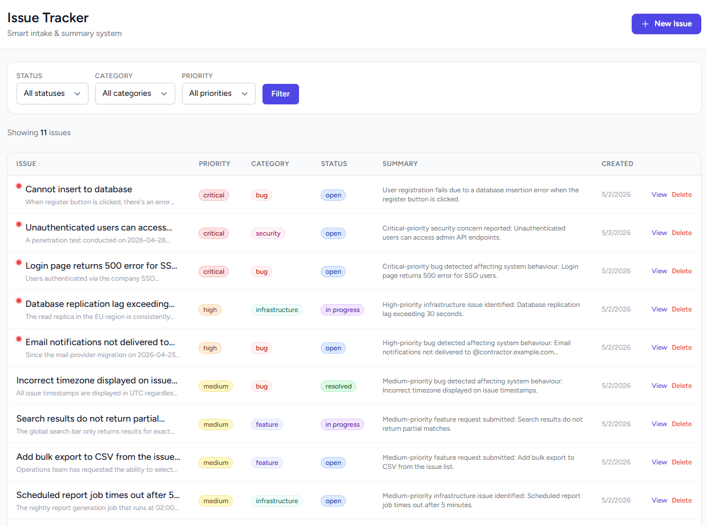
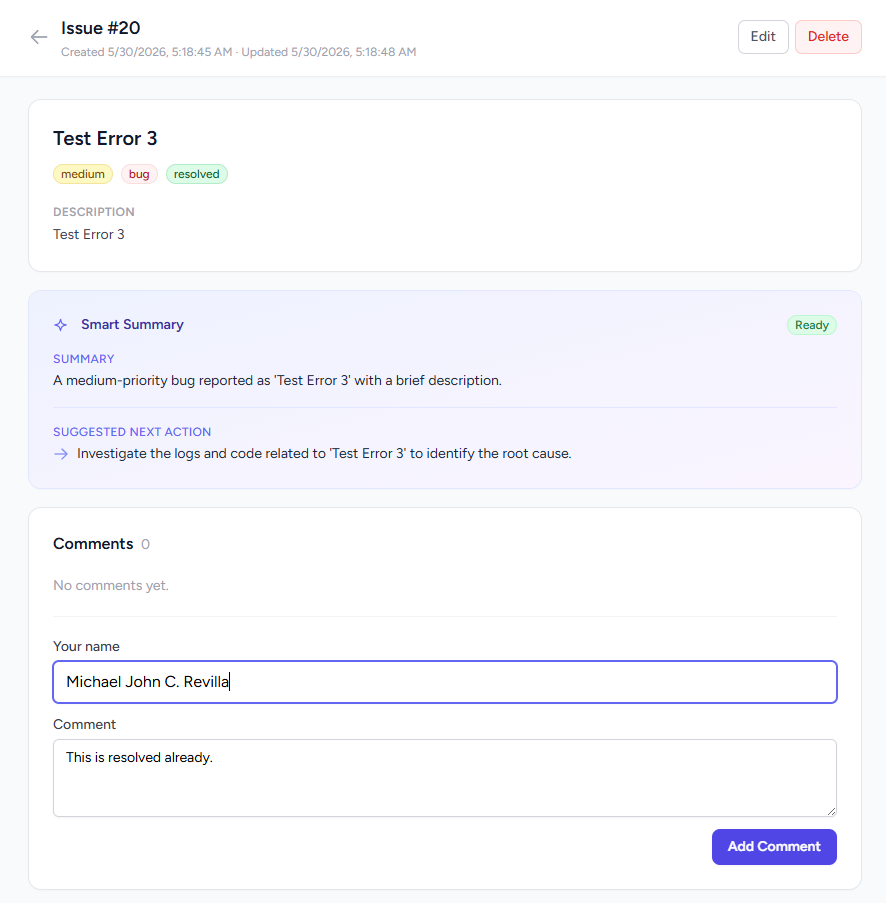

# Issue Intake & Smart Summary System

A production-style Laravel + React (Inertia.js) application for a support/operations team to submit, track, and automatically summarise issues. Each issue receives an AI-generated (or rules-based) short summary and suggested next action on creation or update.

---

## Screenshots

**Issue list** — sorted by urgency, colour-coded badges, escalation indicators, and inline filters:



**Issue detail** — smart summary with live generation status, suggested next action, escalation
banner, and comments:



---

## Stack

| Layer      | Technology                                    |
|------------|-----------------------------------------------|
| Backend    | PHP 8.3+ / Laravel 13                         |
| Frontend   | React 18 + Inertia.js (no full-page reloads)  |
| Styling    | Tailwind CSS v3                               |
| Database   | MySQL                                         |
| AI         | Google Gemini `gemini-2.0-flash` with rules-based fallback |
| Build tool | Vite 8                                        |

---

## Quick Start

### 1. Clone and install

```bash
git clone <repo-url>
cd issue-summary-system

composer install
npm install --legacy-peer-deps
```

> `--legacy-peer-deps` is required because `@vitejs/plugin-react` v4's peer-dep range
> was declared before Vite 8 was released; they are functionally compatible.

### 2. Configure environment

```bash
cp .env.example .env
php artisan key:generate
```

**To enable AI summaries**, open `.env` and add:

```
GEMINI_API_KEY=your-key-here
```

Get a free key at [aistudio.google.com](https://aistudio.google.com/apikey).

If this key is absent or the API call fails, the system automatically falls back to the
built-in rules-based summary engine — no configuration required.

### 3. Database setup

The project uses MySQL. Create a database and configure `.env`:

```
DB_CONNECTION=mysql
DB_HOST=127.0.0.1
DB_PORT=3306
DB_DATABASE=issue_summary_system
DB_USERNAME=root
DB_PASSWORD=your-password
```

Then run:

```bash
php artisan migrate
php artisan db:seed          # loads 10 sample issues + comments
```

### 4. Run the application

Open **three terminals**:

```bash
# Terminal 1 — Laravel dev server
php artisan serve

# Terminal 2 — Vite asset watcher
npm run dev

# Terminal 3 — queue worker (generates summaries asynchronously)
php artisan queue:work
```

Visit **http://localhost:8000**

> **The queue worker is required for summaries to appear.** New issues are saved
> immediately with `summary_status = pending`; the worker picks up the job, calls the
> generator, and flips the issue to `ready`. Without a worker running, issues stay
> `pending` (seeded issues already have summaries, since the seeder generates them inline).

---

## Features

### Issue Management
- **Create** issues with title, description, priority, category, and status
- **List** all issues sorted by urgency (critical → high → medium → low), with pagination
- **Filter** by status, category, and priority (combinable)
- **View** full issue detail including generated summary
- **Update** any field — summary regenerates automatically when content changes
- **Delete** issues

### Smart Summary & Next Action (asynchronous)
Every issue gets a `summary` (one sentence) and `next_action` (a single concrete step),
produced **by a background job — never inside the request**. The flow:

1. `POST /issues` saves the issue with `summary_status = pending` and returns **202 Accepted**
   immediately (summary fields `null`).
2. `GenerateIssueSummary` is dispatched onto the queue.
3. The worker runs the generator, writes `summary` + `next_action`, and sets `summary_status = ready`.
4. If the job exhausts its retries, `failed()` sets `summary_status = failed` (the row lands in
   `failed_jobs`, the dead-letter table) — **a failed job never crashes the API**.

Updating an issue's **description** (or title/priority/category) re-dispatches the job and resets
status to `pending`. Updating **status alone does not** re-trigger generation.

On the web UI, while an issue is `pending` the detail page polls with an Inertia **partial reload**
(re-fetching only the `issue` prop every 2.5s) and flips to the summary automatically once the
worker finishes — no manual refresh, no full page reload.

The generator itself sits behind one interface, `SummaryService::generate()`:

| Mode        | When active                    | Description                                                     |
|-------------|--------------------------------|-----------------------------------------------------------------|
| AI          | `GEMINI_API_KEY` set in `.env` | Calls `gemini-2.0-flash`; structured JSON prompt; strips fences |
| Rules-based | Key missing or API call fails  | Matrix of category × priority → deterministic text              |

The fallback is **always available** — the app runs locally without an API key and never throws
due to missing AI config.

### Comments
Each issue has zero or more comments (`issue → hasMany → comments`). Add one via
`POST /issues/{id}/comments`. The single-issue view returns the issue **with its comments
eager-loaded** (`->load('comments')`) so it never triggers N+1 queries.

### Escalation / needs-attention flag
Issues with `priority = high | critical` and `status = open | in_progress` are automatically
flagged via the boolean **`is_escalated`** column (this is the spec's `needs_attention` flag —
see [field naming](#field-naming-vs-the-spec)). It is recomputed in the model's
`refreshEscalation()` on **every create and update**, so it can never drift from priority/status.
Escalated issues show a red indicator in the list and a warning banner on the detail page.

### Validation
All inputs are validated server-side via Laravel Form Requests with descriptive error messages.
Invalid or incomplete requests return HTTP 422 with a JSON/Inertia error payload.

---

## API Reference

All endpoints live under `/api` and return JSON. No authentication is required for this demo.

| Method | Endpoint                      | Description                                            | Success |
|--------|-------------------------------|--------------------------------------------------------|---------|
| GET    | `/api/issues`                 | List issues (filter: `status`, `category`, `priority`; paginated) | 200 |
| POST   | `/api/issues`                 | Create an issue (summary generated async)              | **202** |
| GET    | `/api/issues/{id}`            | Get a single issue **with its comments**               | 200     |
| PATCH  | `/api/issues/{id}`            | Update an issue                                        | 200     |
| DELETE | `/api/issues/{id}`            | Delete an issue                                        | 200     |
| POST   | `/api/issues/{id}/comments`   | Add a comment to an issue                              | 201     |

**Status codes:** `202` create accepted (summary pending) · `200` read/update · `201` comment
created · `422` validation error (consistent JSON error shape) · `404` not found.

### Example: Create an issue

Returns **202** immediately with `summary_status: "pending"`; the summary is filled in by the worker.

```bash
curl -i -X POST http://localhost:8000/api/issues \
  -H "Content-Type: application/json" \
  -H "Accept: application/json" \
  -d '{
    "title": "Payment gateway returning 503",
    "description": "Stripe webhooks are failing with 503 errors since 14:00 UTC. Checkout is broken for all users. No deployments were made today.",
    "priority": "critical",
    "category": "infrastructure",
    "status": "open"
  }'
```

### Example: Filter issues (combinable)

```bash
curl "http://localhost:8000/api/issues?priority=critical&status=open" \
  -H "Accept: application/json"
```

### Example: Add a comment

```bash
curl -X POST http://localhost:8000/api/issues/1/comments \
  -H "Content-Type: application/json" \
  -H "Accept: application/json" \
  -d '{"author_name": "Jordan Lee", "body": "I can reproduce this on the latest build."}'
```

### Example: Update status (does not re-trigger summary)

```bash
curl -X PATCH http://localhost:8000/api/issues/1 \
  -H "Content-Type: application/json" \
  -H "Accept: application/json" \
  -d '{"status": "in_progress"}'
```

---

## Project Structure

```
app/
├── Http/
│   ├── Controllers/
│   │   ├── IssueController.php          # Web (Inertia) controller
│   │   ├── CommentController.php        # Web comment create
│   │   └── Api/
│   │       ├── IssueController.php      # Pure JSON API controller
│   │       └── CommentController.php    # JSON comment create
│   └── Requests/
│       ├── StoreIssueRequest.php        # Create validation
│       ├── UpdateIssueRequest.php       # Update validation
│       └── StoreCommentRequest.php      # Comment validation
├── Jobs/
│   └── GenerateIssueSummary.php         # Async summary job (retry + dead-letter)
├── Models/
│   ├── Issue.php                        # Model, scopes, escalation, comments() relation
│   └── Comment.php                      # belongsTo Issue
└── Services/
    └── SummaryService.php               # Gemini + rules-based fallback (the seam)

database/
├── factories/
│   ├── IssueFactory.php
│   └── CommentFactory.php
├── migrations/
│   ├── ..._create_issues_table.php
│   ├── ..._add_summary_status_to_issues_table.php
│   └── ..._create_comments_table.php
└── seeders/
    └── IssueSeeder.php                  # 10 issues + comments

resources/js/
├── Components/Badge.jsx                 # Colour-coded priority/status/category chips
└── Pages/Issues/
    ├── Index.jsx                        # List + filter view
    ├── Create.jsx                       # New issue form
    └── Show.jsx                         # Detail + inline edit + comments + summary status

tests/Feature/
├── IssueApiTest.php                     # create, validation, filters, N+1, job dispatch
├── CommentApiTest.php                   # add comment, comment validation
└── GenerateIssueSummaryJobTest.php      # job populates summary/next_action/status

routes/
├── web.php                              # Inertia routes
└── api.php                              # JSON API routes
```

---

## Architecture & Key Decisions

### Why MySQL?
MySQL is a well-established relational database that handles concurrent writes cleanly, supports
full-text indexing for future search features, and is the standard choice in production Laravel
deployments. The data model is a classic one-to-many (`issues` → `comments`) that a relational
store models naturally with a foreign key and cascade delete. MySQL was chosen over SQLite for
production parity; any relational database would work behind Eloquent.

### Why the summary runs asynchronously (the async boundary)
Generation can call a remote LLM, which is slow and can fail — that does not belong in the
request cycle. So `POST /issues` only persists the row and dispatches `GenerateIssueSummary`,
then returns **202** in milliseconds. The worker does the slow work and updates the row. This
keeps create/update snappy and means **a generator failure can never crash the API** — it just
leaves `summary_status = failed`. The job declares `$tries = 3` with `[10, 30, 60]s` backoff;
after that the payload lands in `failed_jobs` (the dead-letter table) for inspection/replay.

Re-generation is gated on intent: the controller checks `isDirty(['title','description',
'priority','category'])`, so editing the **description re-triggers** the job while changing
**status alone does not**.

### SummaryService design (the swappable seam)
`SummaryService::generate(Issue): array` is the single entry point for both engines — the job,
controllers, and seeder never know which one ran. The service:
1. Checks for `GEMINI_API_KEY` via `config('services.gemini.key')`.
2. Calls the Gemini `generateContent` REST API with a structured prompt that requests JSON (the
   prompt template lives in `SummaryService::fromGemini()`).
3. Strips markdown code fences from the response (models sometimes include them).
4. **Falls back to the rules-based engine on any failure** (no key, network error, unexpected
   format, rate-limit). The fallback is a real category × priority matrix, not a stub, so the app
   is fully functional offline. Dropping in an OpenAI/Anthropic/Ollama driver means adding one
   private method and a config switch — the interface and all callers stay the same.

### No N+1 on the relationship
`show()` calls `$issue->load('comments')`, so the issue and all its comments load in two queries
regardless of comment count. `IssueApiTest::test_single_issue_view_loads_comments_without_n_plus_1`
seeds 12 comments and asserts the query count stays bounded — a regression guard against anyone
removing the eager load.

### Escalation logic
Escalation is a pure domain rule on the model — `Issue::refreshEscalation()` — called from both
controllers so the flag stays consistent regardless of how an issue is created or updated. This
makes it easy to extend (e.g., add time-based escalation) without touching controllers.

### Dual interface (web + API)
The app exposes both an Inertia web UI (`/issues`) and a REST JSON API (`/api/issues`), each with
its own thin controller (`Inertia::render()` vs `response()->json()`). Both share the same Form
Requests, `SummaryService`, and `GenerateIssueSummary` job, so validation and business logic are
never duplicated.

### Field naming vs the spec
The schema predates this iteration and uses two names that differ from the spec's examples; they
map 1:1:

| Spec field             | This project    | Notes                                              |
|------------------------|-----------------|----------------------------------------------------|
| `needs_attention`      | `is_escalated`  | Boolean, true for high/critical + open/in_progress |
| `suggested_next_action`| `next_action`   | Same meaning; single concrete step                 |
| `summary_status`       | `summary_status`| `pending` → `ready` / `failed`                     |

---

## Testing

```bash
php artisan test          # 11 tests, all green; uses an in-memory SQLite DB + sync queue
```

Coverage maps directly to the spec's required cases:

| # | Test | What it proves |
|---|------|----------------|
| 1 | `test_can_create_an_issue_and_summary_starts_pending` | Successful create → 202, `summary_status = pending` |
| 2 | `test_create_rejects_missing_and_invalid_fields` | Validation failure (missing + invalid `priority`) → 422 |
| 3 | `test_list_can_combine_status_and_priority_filters` | Two filters combined |
| 4 | `test_can_add_a_comment_to_an_existing_issue` | Comment on the relationship → 201 |
| 5 | `test_single_issue_view_loads_comments_without_n_plus_1` | Eager loading / bounded query count |
| 6 | `test_creating_an_issue_dispatches_the_summary_job` | `Queue::fake()` + `assertPushed` |
| 7 | `test_running_the_job_populates_summary_next_action_and_status` | Job fills all three fields |

Plus: comment body/author validation, status-only update **not** re-dispatching, description
update **re-dispatching**, and a failed job marking `summary_status = failed`.

---

## AI Usage

- **Tool:** Claude (Anthropic) was used as a pair-programming assistant.
- **What for:** scaffolding the async layer (the `GenerateIssueSummary` job, retry/dead-letter
  policy), the `comments` migration/model/relationship and endpoints, the test suite, and this
  documentation pass.
- **What I reviewed and changed:** I verified every migration and route, confirmed the N+1 guard
  by asserting on query count, chose to keep the existing `is_escalated`/`next_action` names
  (documented above) rather than churn the schema, set the create response to **202** to reflect
  the async boundary, and removed the leftover Laravel Breeze auth/profile tests that referenced
  routes this demo doesn't expose. All generated code was read and runs under `php artisan test`.

---

## What I Would Improve With More Time

1. **Authentication & roles** — Gate issue creation/deletion to logged-in users; add an admin role for escalation management.
2. **Push instead of poll** — The detail page currently polls via an Inertia partial reload while `pending`. Broadcasting a WebSocket/SSE event from the job on completion would drop the polling entirely.
3. **Time-based escalation** — A scheduled command could re-evaluate escalation for issues open longer than a configurable SLA window (the spec's "overdue" case).
4. **Audit log** — Store a history of status changes and who made them (an `issue_events` table or `spatie/laravel-activitylog`).
5. **AI model abstraction** — Make the provider/model configurable via `.env` so teams can switch to GPT-4o, Claude, or a local Ollama endpoint without a code change.
6. **Caching** — Cache summaries to avoid redundant API calls on re-reads, and add optimistic locking for concurrent edits.
